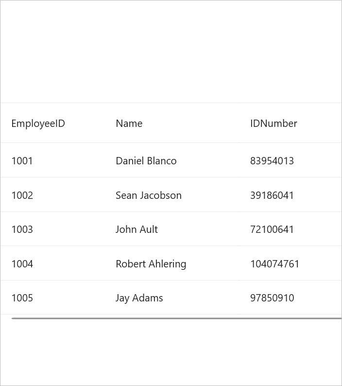

# How to load .NET MAUI DataGrid SfDataGrid with specific height and width
You can load the [SfDataGrid](https://www.syncfusion.com/maui-controls/maui-datagrid) with specific height and width in various layouts by utilizing the `SfDataGrid.HeightRequest` and `SfDataGrid.WidthRequest` properties. It's important to adjust the HorizontalOptions and VerticalOptions for the grid accordingly.

For instance, when defining a width request, ensure that the HorizontalOptions of the `SfDataGrid` align with your requirements. Similarly, when specifying a height request, configure the VerticalOptions of the grid accordingly. In the event of setting both, make sure to adjust both HorizontalOptions and VerticalOptions accordingly.

##### Xaml:
 
 ```XML
<syncfusion:SfDataGrid ColumnWidthMode="Auto"
                       HeightRequest="300"
                       VerticalOptions="Center"
                       ItemsSource="{Binding Employees}">

</syncfusion:SfDataGrid>
 ```
 

Executing the code example above yields the following output.



[View sample in GitHub](https://github.com/SyncfusionExamples/How-to-load-.NET-MAUI-DataGrid-SfDataGrid-with-specific-height-and-width)

Take a moment to explore this [documentation](https://help.syncfusion.com/maui/datagrid/overview), where you can find more information about Syncfusion .NET MAUI DataGrid (SfDataGrid) with code examples. Please refer to this [link](https://www.syncfusion.com/maui-controls/maui-datagrid) to learn about the essential features of Syncfusion .NET MAUI DataGrid (SfDataGrid).

##### Conclusion

I hope you enjoyed learning about how to load .NET MAUI DataGrid (SfDataGrid) with specific height and width.

You can refer to our [.NET MAUI DataGrid’s feature tour](https://www.syncfusion.com/maui-controls/maui-datagrid) page to learn about its other groundbreaking feature representations. You can also explore our .NET MAUI DataGrid Documentation to understand how to present and manipulate data. For current customers, you can check out our .NET MAUI components on the [License and Downloads](https://www.syncfusion.com/account/downloads) page. If you are new to Syncfusion, you can try our 30-day free trial to explore our .NET MAUI DataGrid and other .NET MAUI components. If you have any queries or require clarifications, please let us know in the comments below. You can also contact us through our [support forums](https://www.syncfusion.com/forums), [Direct-Trac](https://support.syncfusion.com/account/login?ReturnUrl=%2Faccount%2Fconnect%2Fauthorize%2Fcallback%3Fclient_id%3Dc54e52f3eb3cde0c3f20474f1bc179ed%26redirect_uri%3Dhttps%253A%252F%252Fsupport.syncfusion.com%252Fagent%252Flogincallback%26response_type%3Dcode%26scope%3Dopenid%2520profile%2520agent.api%2520integration.api%2520offline_access%2520kb.api%26state%3D8db41f98953a4d9ba40407b150ad4cf2%26code_challenge%3DvwHoT64z2h21eP_A9g7JWtr3vp3iPrvSjfh5hN5C7IE%26code_challenge_method%3DS256%26response_mode%3Dquery) or [feedback portal](https://www.syncfusion.com/feedback/maui?control=sfdatagrid), or the feedback portal. We are always happy to assist you!
